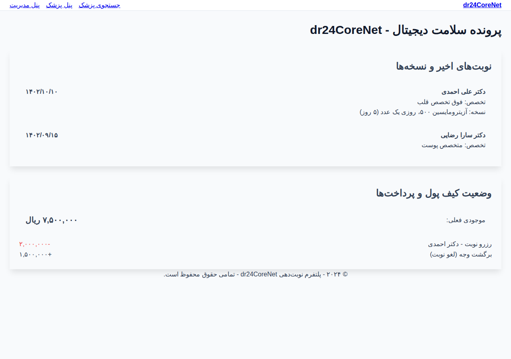
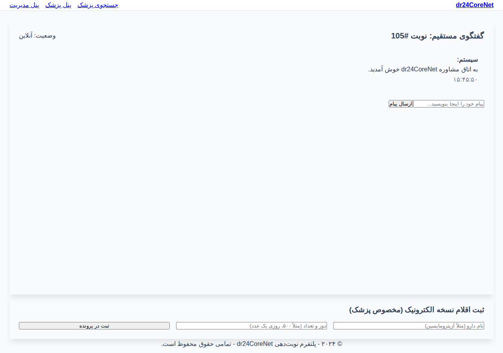

# پلتفرم جامع نوبت‌دهی پزشکی dr24CoreNet (نسخه اینترپرایز)

پروژه dr24CoreNet یک پلتفرم اینترپرایز پیشرفته برای مدیریت نوبت‌دهی، مشاوره آنلاین و تحلیل‌های مالی پزشکی است که بر پایه معماری Clean Architecture و ASP.NET Core 10 توسعه یافته است. این سیستم برای هندل کردن سناریوهای با بار ترافیکی بالا و تضمین امنیت داده‌های پزشکی طراحی شده است.

## معماری و تکنولوژی‌های کلیدی
- لایه دامنه (Domain): شامل مدل‌های غنی بیزینسی، مدیریت کیف پول، ارجاعات هوشمند و لاگ‌های حسابرسی HIPAA.
- مدیریت همزمانی (Concurrency): استفاده همزمان از Optimistic Concurrency (RowVersion) و Pessimistic Locking برای تضمین رزرو نوبت در کسری از میلی‌ثانیه.
- زیرساخت (Infrastructure): پیاده‌سازی سرویس‌های پس‌زمینه (Background Workers) برای آزادسازی خودکار نوبت‌های منقضی شده و تولید اسنپ‌شات‌های تحلیلی.
- رابط کاربری (WebUI): طراحی مدرن با فونت بومی وزیر، بدون وابستگی به CDN، همراه با تم تاریک و روشن خودکار.

## ویژگی‌های پیشرفته اینترپرایز
۱. سیستم رزرو موقت با تایمر معکوس ۱۰ دقیقه‌ای برای تکمیل پرداخت.
۲. لاگ حسابرسی (Audit Trail) غیرقابل تغییر برای ردیابی هرگونه دسترسی به داده‌های حساس بیمار.
۳. موتور ارجاع هوشمند بین‌پزشکی با توکن‌های دیجیتال اولویت‌دار.
۴. داشبورد تحلیل هوشمند با استفاده از Materialized Views شبیه‌سازی شده برای عملکرد بهینه در داده‌های حجیم.

## راهنمای راه‌اندازی زیرساخت (Docker)
پروژه dr24CoreNet به طور کامل داکریزه شده است تا در هر محیطی بدون نیاز به نصب دستی پیش‌نیازها اجرا شود. برای راه‌اندازی کامل سیستم شامل وب‌سایت، API و پایگاه داده PostgreSQL، کافیست دستور زیر را در پوشه ریشه اجرا کنید:

```bash
docker compose up --build
```

### فرآیند خودکار پس از اجرا:
- **ارکستراسیون**: داکر کانتینرهای مجزا برای دیتابیس، API و پنل کاربری ایجاد می‌کند.
- **مهاجرت دیتابیس**: سیستم به طور خودکار تمام Migrationهای Entity Framework را روی PostgreSQL اعمال می‌کند.
- **تزریق داده‌های انبوه (Seeding)**: پایگاه داده با بیش از ۵۰ پروفایل پزشک متخصص ایرانی، هزاران اسلات زمانی و تاریخچه تراکنش‌های مالی پر می‌شود تا سیستم کاملاً زنده به نظر برسد.
- **دسترسی**: پنل کاربری در پورت `5001` و مستندات Swagger API در پورت `5000` در دسترس خواهند بود.

## معماری و ساختار پروژه (Clean Architecture)
این پروژه از ساختار لایه‌ای استاندارد برای تضمین قابلیت نگهداری و تست‌پذیری استفاده می‌کند:

- **dr24CoreNet.Domain**: لایه مرکزی شامل موجودیت‌های بیزینسی (پزشک، بیمار، نوبت)، مدیریت کیف پول، ارجاعات تخصصی و مدل‌های Audit Trail.
- **dr24CoreNet.Application**: شامل اینترفیس‌های Repository، DTOها و منطق‌های بیزینسی مانند الگوریتم تولید خودکار اسلات و مدیریت ارجاعات.
- **dr24CoreNet.Infrastructure**: پیاده‌سازی زیرساخت شامل EF Core، سرویس‌های پس‌زمینه (Background Workers) برای آزادسازی نوبت‌ها، و کشینگ اسنپ‌شات‌های تحلیلی.
- **dr24CoreNet.WebAPI**: لایه ارتباطی شامل REST APIها و Hubهای SignalR برای مشاوره زنده.
- **dr24CoreNet.WebUI**: رابط کاربری مدرن طراحی شده با Razor Pages و سیستم CSS محلی (Tailwind-like) همراه با فونت بومی وزیر.

```
.
├── dr24CoreNet/
│   ├── dr24CoreNet.Domain/         # Core Domain Logic
│   ├── dr24CoreNet.Application/    # Business Services & Interfaces
│   ├── dr24CoreNet.Infrastructure/ # Persistence & Background Tasks
│   ├── dr24CoreNet.WebAPI/         # API Endpoints & SignalR
│   ├── dr24CoreNet.WebUI/          # Modern Premium Frontend
│   ├── Dockerfile                  # Multi-stage Optimized Build
│   └── docker-compose.yml          # Full System Orchestration
├── dr24CoreNet.Tests/              # XUnit Unit & Integration Tests
├── screenshots/                    # Actual High-Res Screenshots
└── README.md                       # Project Guidance (Root)
```

## اسکرین‌شات‌های پیشرفته
### ۱. صفحه جستجوی پیشرفته پزشکان (با فونت وزیر)


### ۲. سیستم رزرو موقت با تایمر معکوس ۱۰ دقیقه‌ای


### ۳. تایم‌لاین حسابرسی پزشکی (HIPAA Audit Trail)


### ۴. داشبورد تحلیل هوشمند چندمحوره (Chart.js)


### ۵. پرونده الکترونیک و سوابق پزشکی بیمار


### ۶. محیط مشاوره آنلاین و چت متنی

