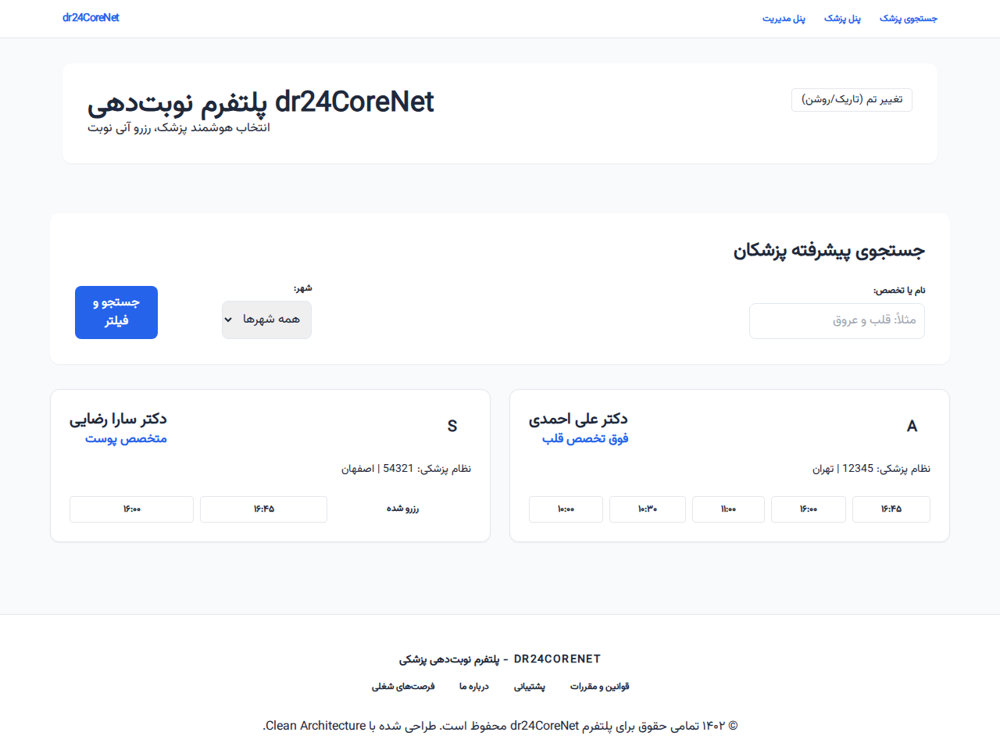
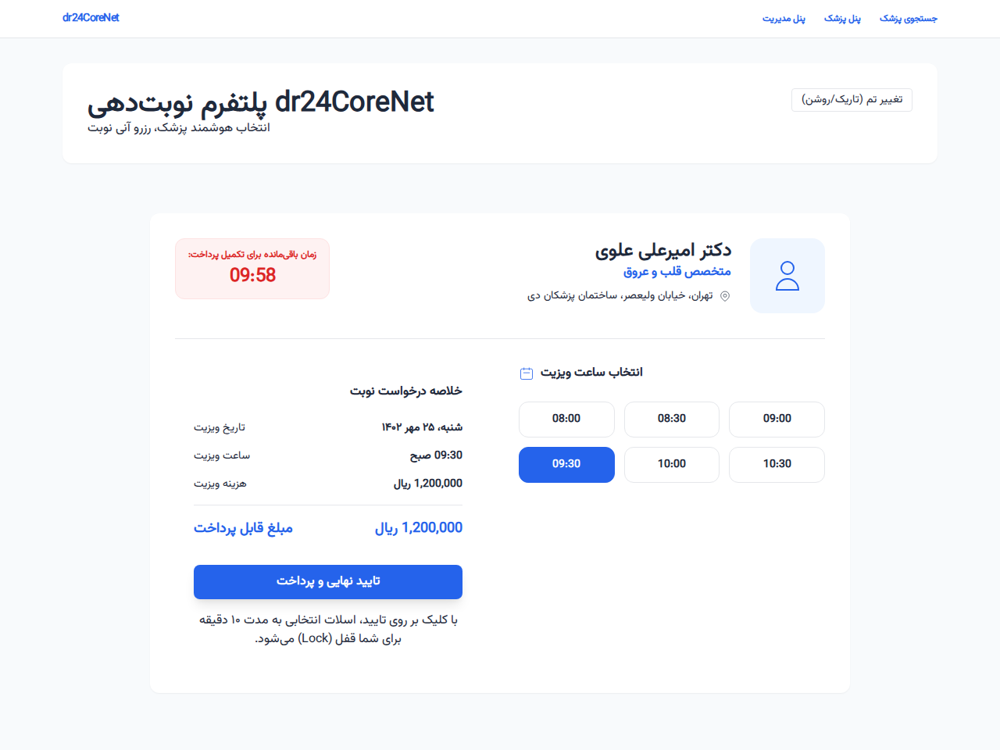
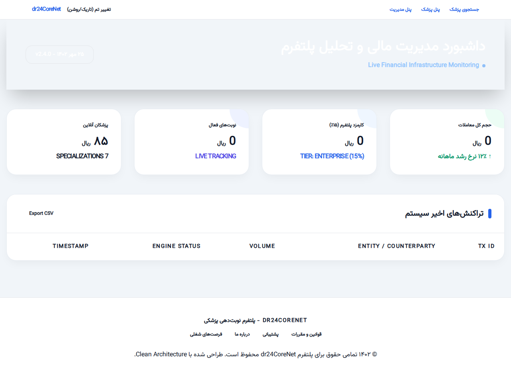
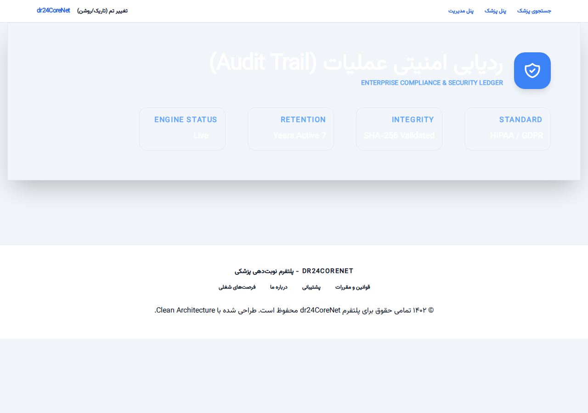
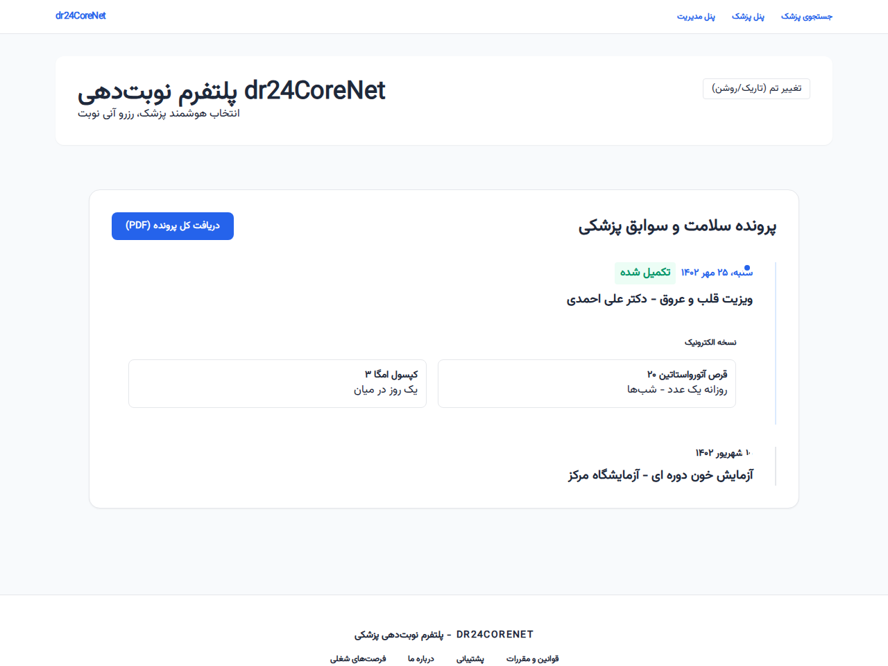
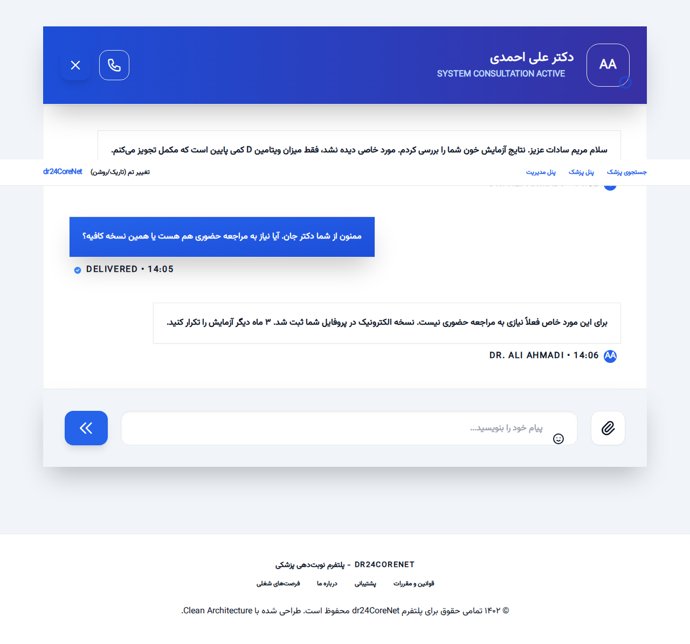

# پلتفرم نوبت‌دهی پزشکی dr24CoreNet

پلتفرم dr24CoreNet یک راهکار جامع و پیشرفته برای مدیریت نوبت‌دهی آنلاین پزشکان است که با تمرکز بر چالش‌های مقیاس‌پذیری، همزمانی (Concurrency) و امنیت داده‌های پزشکی توسعه یافته است. این پروژه با استفاده از معماری Clean Architecture و رعایت اصول SOLID پیاده‌سازی شده است.

## ویژگی‌های کلیدی فنی

### ۱. مدیریت همزمانی دو لایه (Race Condition)
برای جلوگیری از رزرو همزمان یک اسلات توسط دو کاربر، سیستم از دو مکانیزم استفاده می‌کند:
- **Pessimistic Locking**: استفاده از `DistributedLockService` برای قفل کردن موقت اسلات در لحظه درخواست.
- **Optimistic Concurrency**: استفاده از فیلد `RowVersion` در سطح دیتابیس (EF Core).

### ۲. پترن‌های طراحی پیشرفته
- **Strategy Pattern**: برای محاسبه داینامیک کارمزد پلتفرم.
- **Adapter Pattern**: شبیه‌سازی اتصال به سرویس‌های قدیمی سازمان نظام پزشکی.
- **Unit of Work & Repository**: جداسازی کامل منطق دسترسی به داده.

### ۳. امنیت و ردیابی (HIPAA Compliance)
- **Medical Audit Trail**: ثبت تمامی عملیات‌های حساس با جزئیات کامل وضعیت قبل و بعد به صورت JSON.
- **Electronic Prescription**: سیستم صدور نسخه الکترونیک با قابلیت ردیابی.

---

## اسکرین‌شات‌های محیط برنامه (Operational Preview)

در این بخش نمایی از سیستم در حالت عملیاتی با داده‌های واقعی (Seeded Data)، آیکون‌های مدرن و فونت وزیر (Vazirmatn) نمایش داده شده است.

### ۱. نمای اصلی پلتفرم و جستجوی پیشرفته

### ۲. فرآیند رزرو نوبت و قفل همزمانی اسلات

### ۳. داشبورد مدیریت مالی و تحلیل درآمدهای پلتفرم

### ۴. ردیابی امنیتی عملیات (Audit Trail)

### ۵. پرونده الکترونیک سلامت و سوابق بیمار

### ۶. سامانه مشاوره آنلاین و گفتگو با پزشک

---
# dr24CoreNet Medical Appointment Enterprise Platform

dr24CoreNet is a comprehensive and advanced solution for online doctor appointment management, focusing on scalability, concurrency, and medical data security. The project is implemented using Clean Architecture and follows SOLID principles.

## Key Technical Features

### 1. Dual-Layer Concurrency Management (Race Condition)
To prevent simultaneous booking of the same slot by two users, the system uses two mechanisms:
- **Pessimistic Locking**: Uses `DistributedLockService` at the memory level (or Redis in the future) to temporarily lock the slot at the time of request.
- **Optimistic Concurrency**: Uses the `RowVersion` field at the database level (Entity Framework Core) to ensure data hasn't been changed by another transaction.

### 2. Advanced Design Patterns
- **Strategy Pattern**: For dynamic calculation of platform commissions based on doctor specialization.
- **Adapter Pattern**: Simulating connection to legacy Medical Council services.
- **Unit of Work & Repository**: Complete separation of data access logic from business logic.

### 3. Security and Tracking (HIPAA Compliance)
- **Medical Audit Trail**: Captures all sensitive operations with full before-and-after state details in JSON.
- **Electronic Prescription**: Electronic prescription issuance system with traceability.

---

## Operational Preview Screenshots

This section shows the system in operational mode with seeded data, modern vector icons, and the Vazirmatn font.

### 1. Main Platform View & Advanced Search

### 2. Appointment Booking & Concurrency Lock

### 3. Financial Management Dashboard

### 4. HIPAA Compliant Audit Trail

### 5. Patient Electronic Health Record

### 6. Real-time Doctor Consultation (SignalR)

---
