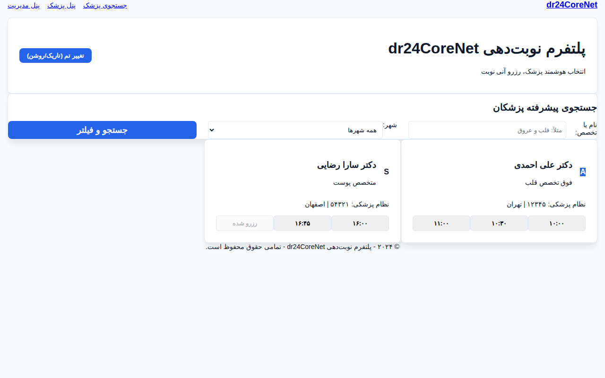
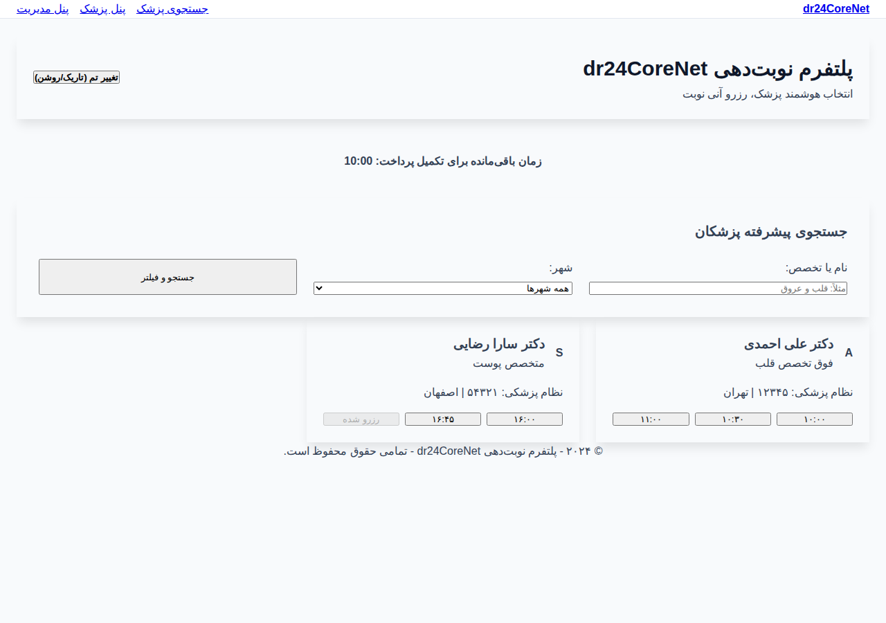
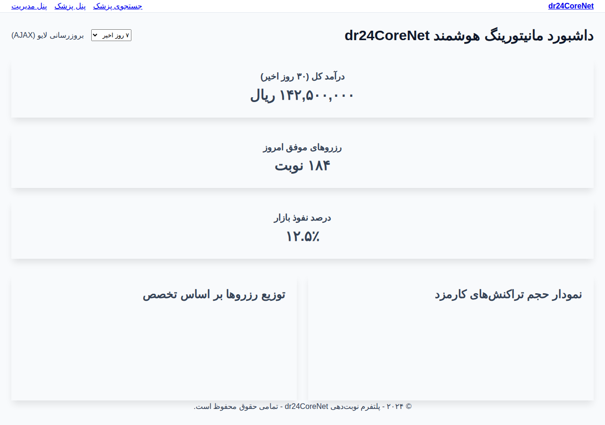

# پلتفرم اینترپرایز نوبت‌دهی پزشکی dr24CoreNet

پلتفرم dr24CoreNet یک راهکار جامع و پیشرفته برای مدیریت نوبت‌دهی آنلاین پزشکان است که با تمرکز بر چالش‌های مقیاس‌پذیری، همزمانی (Concurrency) و امنیت داده‌های پزشکی توسعه یافته است. این پروژه با استفاده از معماری Clean Architecture و رعایت اصول SOLID پیاده‌سازی شده است.

## ویژگی‌های کلیدی فنی

### ۱. مدیریت همزمانی دو لایه (Race Condition)
برای جلوگیری از رزرو همزمان یک اسلات توسط دو کاربر، سیستم از دو مکانیزم استفاده می‌کند:
- **Pessimistic Locking**: استفاده از `DistributedLockService` در سطح حافظه (یا ردیس در آینده) برای قفل کردن موقت اسلات در لحظه درخواست.
- **Optimistic Concurrency**: استفاده از فیلد `RowVersion` در سطح دیتابیس (Entity Framework Core) برای اطمینان از عدم تغییر داده توسط تراکنش دیگر.

### ۲. پترن‌های طراحی پیشرفته
- **Strategy Pattern**: برای محاسبه داینامیک کارمزد پلتفرم بر اساس تخصص پزشک بدون استفاده از ساختارهای شرطی پیچیده.
- **Adapter Pattern**: شبیه‌سازی اتصال به سرویس‌های قدیمی سازمان نظام پزشکی و تبدیل پروتکل‌های سنتی به مدل‌های مدرن سیستم.
- **Unit of Work & Repository**: جداسازی کامل منطق دسترسی به داده از منطق تجاری برنامه.

### ۳. امنیت و ردیابی (HIPAA Compliance)
- **Medical Audit Trail**: ثبت تمامی عملیات‌های حساس (رزرو، صدور نسخه، تغییر کیف پول) با جزئیات کامل وضعیت قبل و بعد به صورت JSON.
- **Electronic Prescription**: سیستم صدور نسخه الکترونیک با قابلیت ردیابی در پرونده سلامت دیجیتال.

### ۴. بهینه‌سازی عملکرد
- **Analytics Snapshots**: استفاده از Background Workers برای تولید اسنپ‌شات‌های آماری (شبیه به Materialized Views) جهت جلوگیری از کوئری‌های سنگین مالی روی جداول اصلی.
- **Memory Cache**: ذخیره‌سازی لیست پزشکان و تخصص‌ها با مکانیزم ابطال خودکار پس از تغییر داده.

---

## ساختار درختی پروژه (Clean Architecture)

```text
dr24CoreNet/
├── dr24CoreNet.Domain/          # موجودیت‌ها، اینوم‌ها و قراردادهای اصلی
├── dr24CoreNet.Application/     # منطق تجاری، سرویس‌ها و اینترفیس‌ها
├── dr24CoreNet.Infrastructure/  # پیاده‌سازی دیتابیس، لاگینگ، امنیت و سرویس‌های خارجی
├── dr24CoreNet.WebAPI/          # وب‌سرویس‌های RESTful برای اپلیکیشن‌های موبایل
└── dr24CoreNet.WebUI/           # رابط کاربری وب (Razor Pages) با Tailwind CSS
```

---

## راهنمای راه‌اندازی سریع

### پیش‌نیازها
- .NET 10.0 SDK
- Docker & Docker Compose

### اجرای سریع با داکر
برای اجرای کل پلتفرم (شامل دیتابیس PostgreSQL و اپلیکیشن) دستور زیر را در ریشه پروژه اجرا کنید:

```bash
docker-compose up --build
```

### اجرای دستی (Development)
۱. تنظیم رشته اتصال در `appsettings.json`
۲. اجرای دستورات مهاجرت دیتابیس:
```bash
dotnet ef database update --project dr24CoreNet.Infrastructure --startup-project dr24CoreNet.WebUI
```
۳. اجرای برنامه:
```bash
dotnet run --project dr24CoreNet.WebUI
```

---

## اسکرین‌شات‌های محیط برنامه (Operational Preview)

در این بخش نمایی از سیستم در حالت عملیاتی با داده‌های واقعی (Seeded Data) و فونت وزیر (Vazirmatn) نمایش داده شده است.

### ۱. صفحه جستجو و فیلتر پزشکان متخصص


### ۲. فرآیند رزرو نوبت و شمارش معکوس قفل همزمانی


### ۳. داشبورد مدیریت مالی و تحلیل درآمدهای پلتفرم


### ۴. ردیابی امنیتی عملیات (Audit Trail) و پرونده سلامت


---

## وابستگی‌های محلی (No CDN)
تمامی فایل‌های استاتیک شامل CSS، JS و فونت‌های Vazirmatn به صورت محلی در پوشه `wwwroot` قرار دارند تا پلتفرم در شبکه‌های داخلی و اینترانت بدون وابستگی به اینترنت جهانی به درستی عمل کند.
