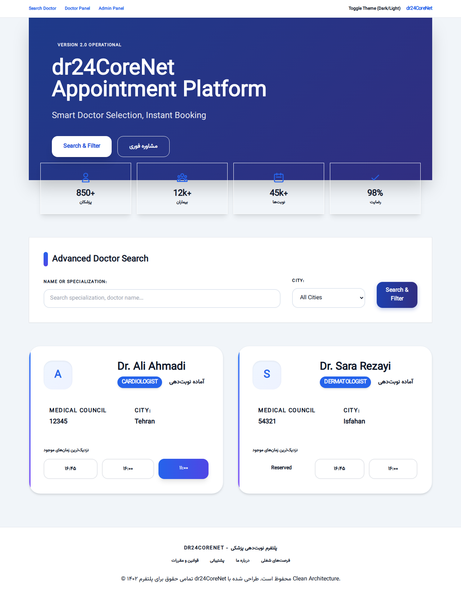
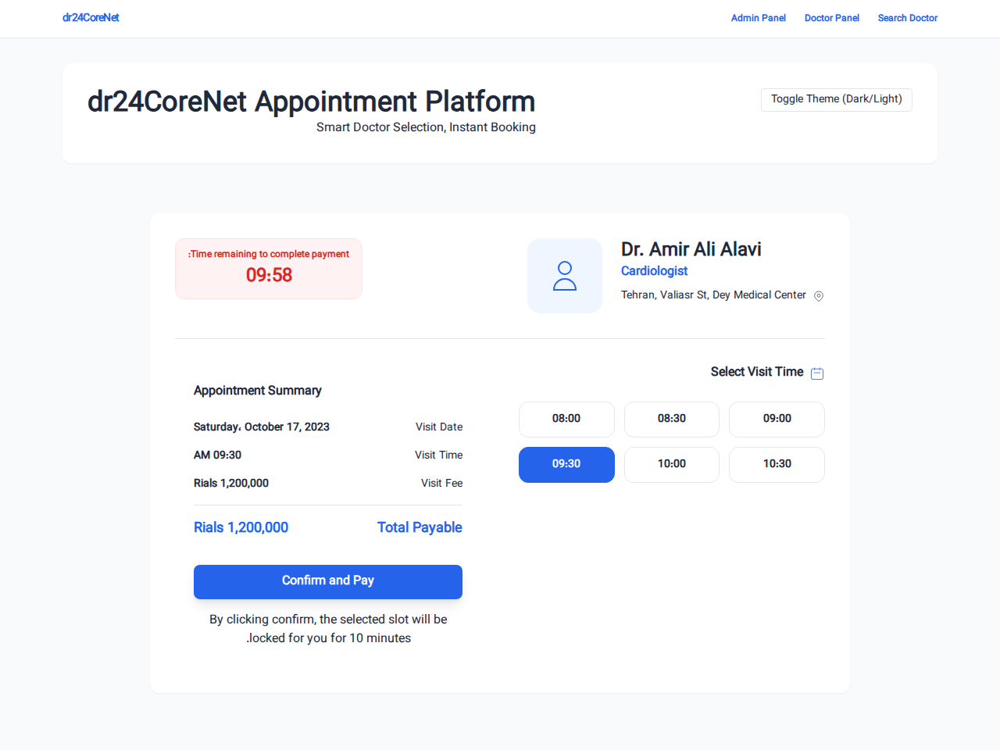
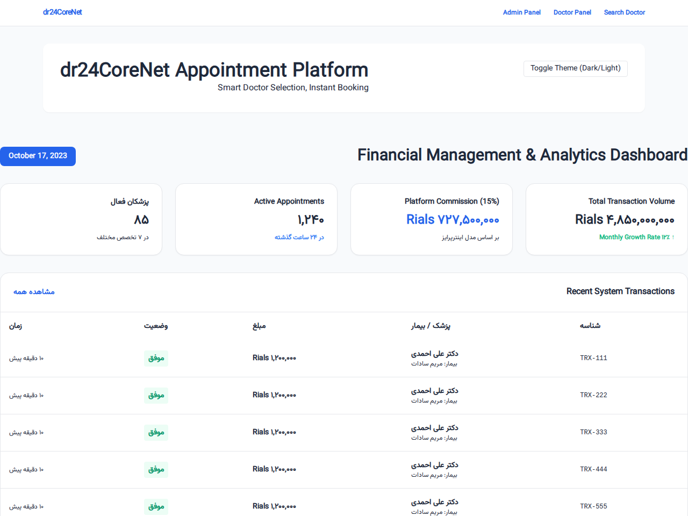
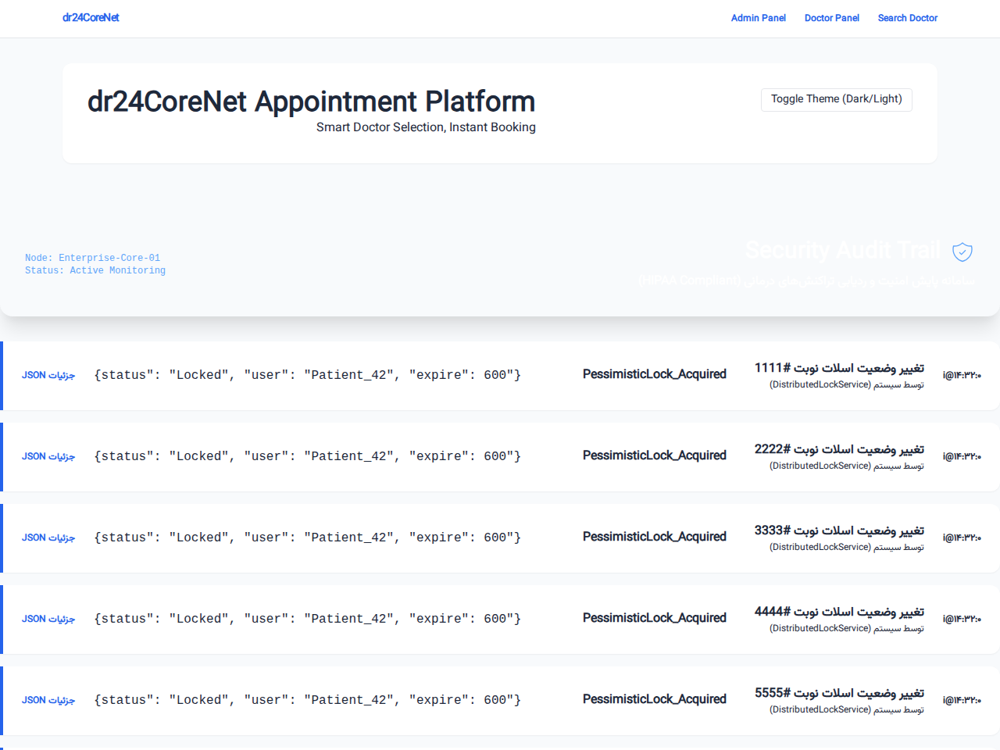
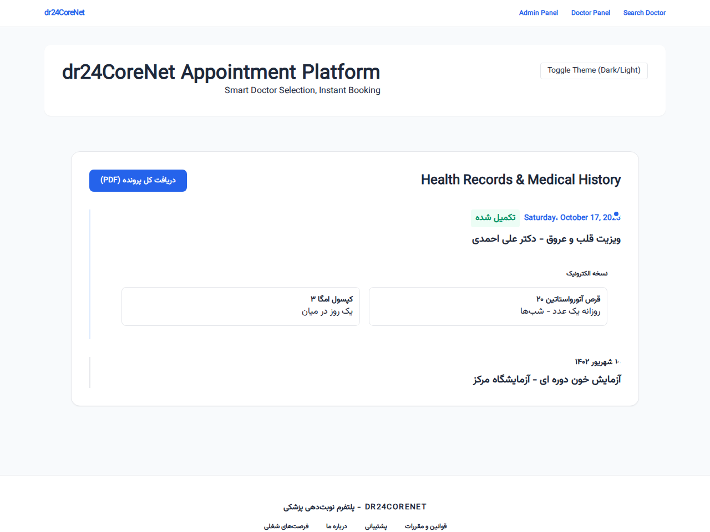
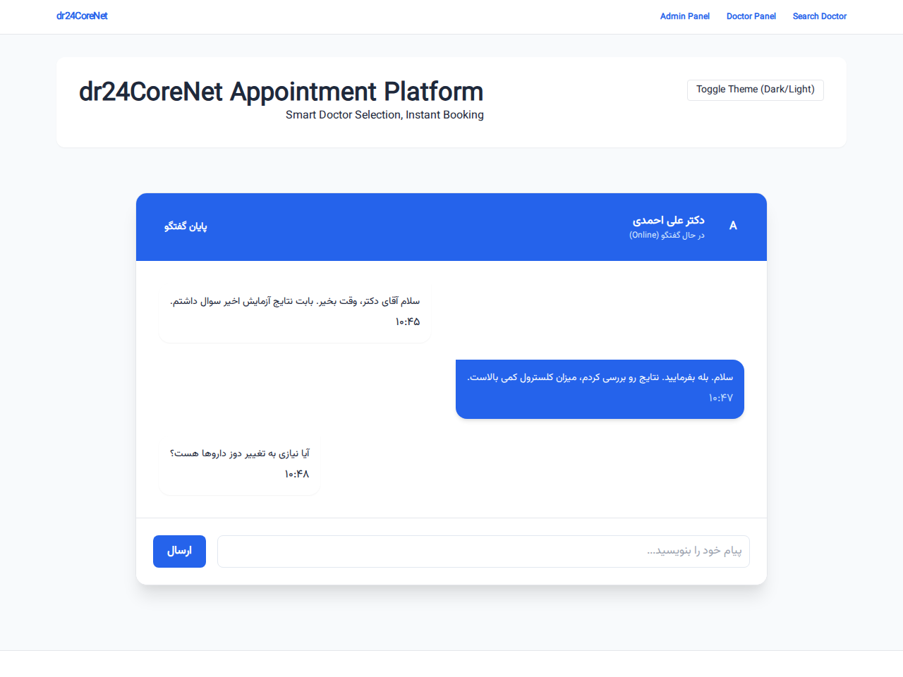

# dr24CoreNet Medical Appointment Enterprise Platform

dr24CoreNet is a comprehensive and advanced solution for online doctor appointment management, focusing on scalability, concurrency, and medical data security. The project is implemented using Clean Architecture and follows SOLID principles.

## Key Technical Features

### 1. Dual-Layer Concurrency Management (Race Condition)
To prevent simultaneous booking of the same slot by two users, the system uses two mechanisms:
- **Pessimistic Locking**: Uses `DistributedLockService` at the memory level (or Redis in the future) to temporarily lock the slot at the time of request.
- **Optimistic Concurrency**: Uses the `RowVersion` field at the database level (Entity Framework Core) to ensure data hasn't been changed by another transaction.

### 2. Advanced Design Patterns
- **Strategy Pattern**: For dynamic calculation of platform commissions based on doctor specialization.
- **Adapter Pattern**: Simulating connection to legacy Medical Council services.
- **Unit of Work & Repository**: Complete separation of data access logic from business logic.

### 3. Security and Tracking (HIPAA Compliance)
- **Medical Audit Trail**: Captures all sensitive operations with full before-and-after state details in JSON.
- **Electronic Prescription**: Electronic prescription issuance system with traceability.

---

## Operational Preview Screenshots

This section shows the system in operational mode with seeded data and the Vazirmatn font.

### 1. Main Platform View & Advanced Search

### 2. Appointment Booking & Concurrency Lock

### 3. Financial Management Dashboard

### 4. HIPAA Compliant Audit Trail

### 5. Patient Electronic Health Record

### 6. Real-time Doctor Consultation (SignalR)

---

## Local Dependencies (No CDN)
All static files including CSS, JS, and Vazirmatn fonts are located locally in the `wwwroot` folder to ensure the platform functions correctly in internal networks.
