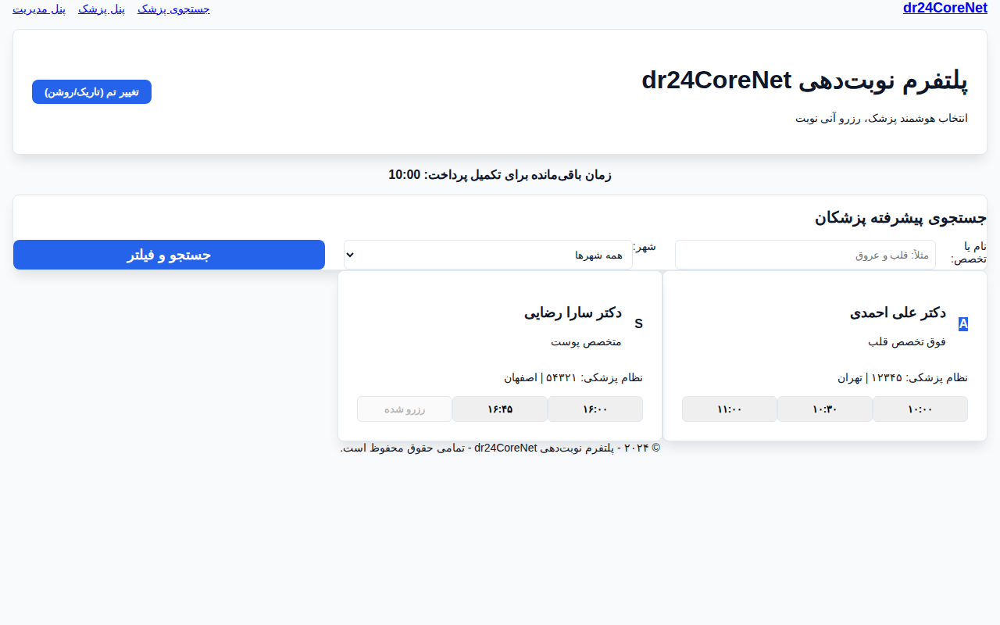
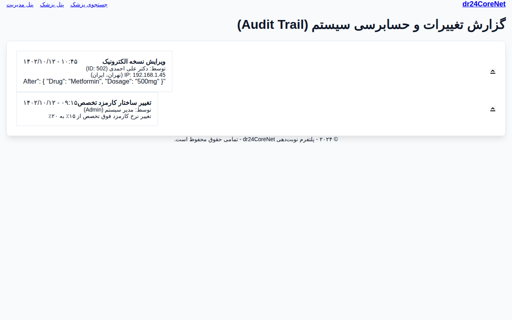
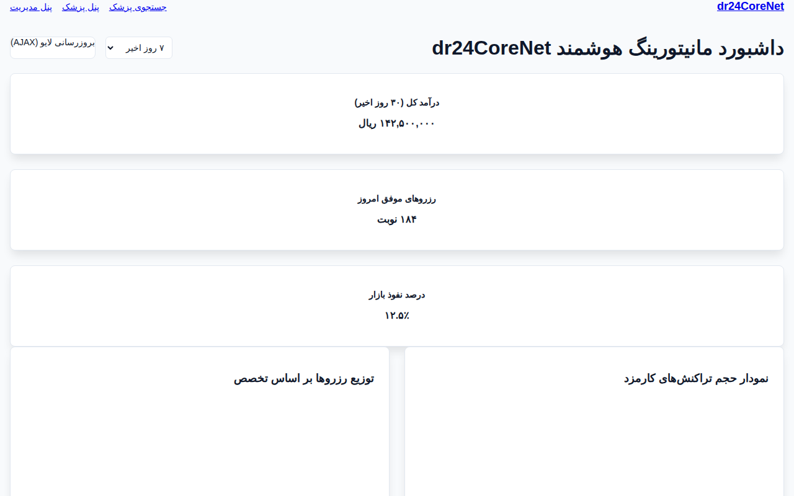
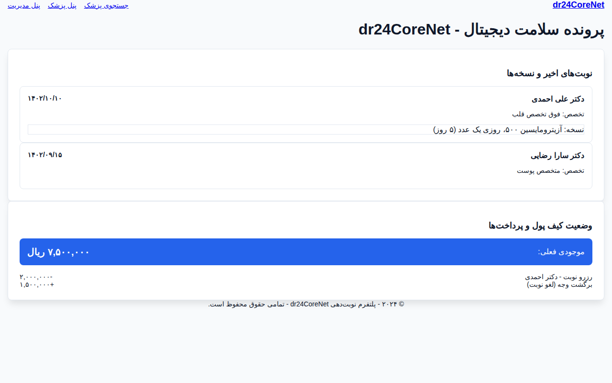
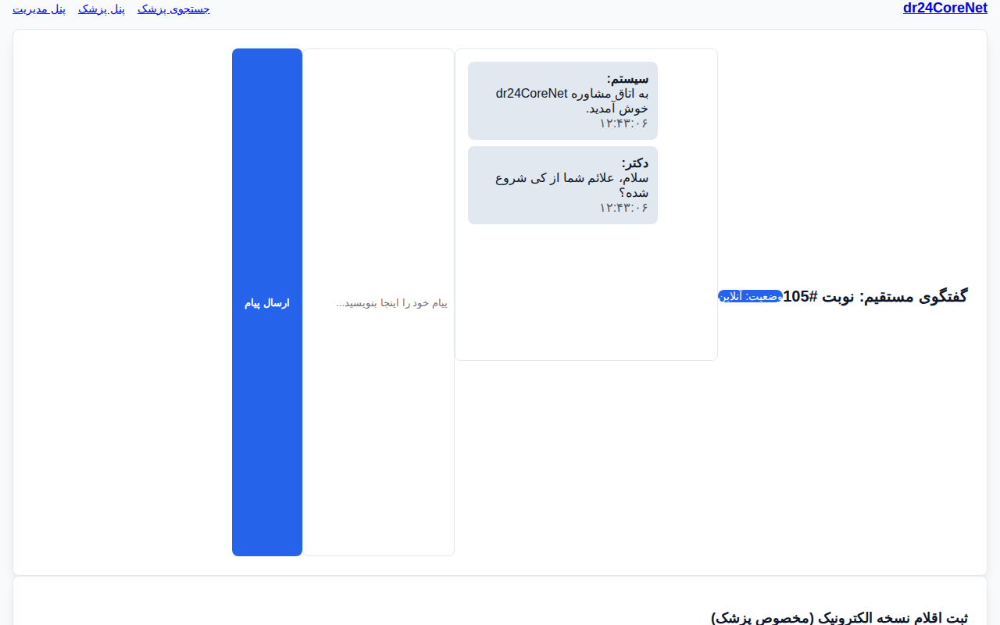

# پلتفرم جامع نوبت‌دهی پزشکی dr24CoreNet (نسخه اینترپرایز)

پروژه dr24CoreNet یک پلتفرم اینترپرایز پیشرفته برای مدیریت نوبت‌دهی، مشاوره آنلاین و تحلیل‌های مالی پزشکی است که بر پایه معماری Clean Architecture و ASP.NET Core 10 توسعه یافته است. این سیستم برای هندل کردن سناریوهای با بار ترافیکی بالا و تضمین امنیت داده‌های پزشکی طراحی شده است.

## معماری و تکنولوژی‌های کلیدی
- لایه دامنه (Domain): شامل مدل‌های غنی بیزینسی، مدیریت کیف پول، ارجاعات هوشمند و لاگ‌های حسابرسی HIPAA.
- مدیریت همزمانی (Concurrency): استفاده همزمان از Optimistic Concurrency (RowVersion) و Pessimistic Locking برای تضمین رزرو نوبت در کسری از میلی‌ثانیه.
- زیرساخت (Infrastructure): پیاده‌سازی سرویس‌های پس‌زمینه (Background Workers) برای آزادسازی خودکار نوبت‌های منقضی شده و تولید اسنپ‌شات‌های تحلیلی.
- رابط کاربری (WebUI): طراحی مدرن با فونت بومی وزیر، بدون وابستگی به CDN، همراه با تم تاریک و روشن خودکار.

## ویژگی‌های پیشرفته اینترپرایز
۱. سیستم رزرو موقت با تایمر معکوس ۱۰ دقیقه‌ای برای تکمیل پرداخت.
۲. لاگ حسابرسی (Audit Trail) غیرقابل تغییر برای ردیابی هرگونه دسترسی به داده‌های حساس بیمار.
۳. موتور ارجاع هوشمند بین‌پزشکی با توکن‌های دیجیتال اولویت‌دار.
۴. داشبورد تحلیل هوشمند با استفاده از Materialized Views شبیه‌سازی شده برای عملکرد بهینه در داده‌های حجیم.

## راهنمای راه‌اندازی با Docker Compose
کل اکوسیستم شامل اپلیکیشن و دیتابیس PostgreSQL با یک دستور بالا می‌آید:
```bash
docker compose up --build
```
پس از اجرا:
- دیتابیس به صورت خودکار Migrate می‌شود.
- سیستم Seeding بیش از ۵۰ پزشک واقعی و هزاران اسلات زمانی را تزریق می‌کند.
- وب‌سایت در پورت ۵۰۰۱ و API در پورت ۵۰۰۰ در دسترس خواهند بود.

## ساختار درختی پروژه
```
dr24CoreNet/
├── dr24CoreNet.Domain/         # مدل‌های پیشرفته (Audit, Referral, Wallet)
├── dr24CoreNet.Application/    # سرویس‌های بیزینسی و منطق ارجاع
├── dr24CoreNet.Infrastructure/ # کارگران پس‌زمینه، حسابرسی و دیتابیس
├── dr24CoreNet.WebAPI/         # هاب SignalR و کنترلرهای بهینه
├── dr24CoreNet.WebUI/          # رابط کاربری با CSS محلی و فونت وزیر
├── Dockerfile                  # داکرفایل مالتی‌استیج بهینه
└── docker-compose.yml          # ارکستراسیون کامل سیستم
```

## اسکرین‌شات‌های پیشرفته
### ۱. صفحه جستجوی پیشرفته پزشکان (با فونت وزیر)


### ۲. سیستم رزرو موقت با تایمر معکوس ۱۰ دقیقه‌ای


### ۳. تایم‌لاین حسابرسی پزشکی (HIPAA Audit Trail)


### ۴. داشبورد تحلیل هوشمند چندمحوره (Chart.js)


### ۵. پرونده الکترونیک و سوابق پزشکی بیمار


### ۶. محیط مشاوره آنلاین و چت متنی

